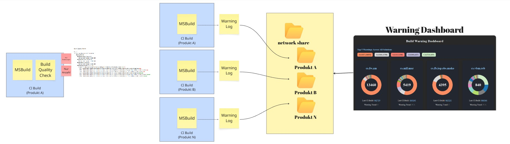

# Build Warning Dashboard

A developer tool that collects warning logs from MSBuild outputs, parses them into structured JSON, and displays them in a modern, filterable Vue.js dashboard.
Easily track, analyze, and fix build warnings across your projects.

## Features

- Parses warnings_*.json files from MSBuild output
- Generates an interactive dashboard with filtering and grouping
- Helps teams prioritize and reduce technical debt
- Lightweight and easy to integrate into CI pipelines



## Run

### 🛠 Prerequisites for Running the Build Warning Dashboard

This project is built with **Vite**, **Vue 3**, and the **Composition API**.

#### ✅ System Requirements

- **Node.js** (LTS version recommended)
  - [Download Node.js](https://nodejs.org/)
- **npm** (comes with Node.js)
- A modern web browser (for development and viewing the dashboard)

```batch
cd BuildWarningAnalyzer
./run.ps1
cd BuildWarningAnalyzer-Vue
npm install && npm run dev
```